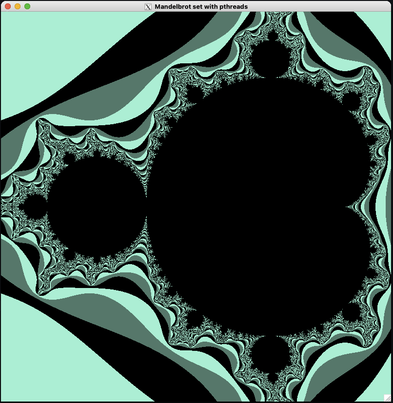

## 💻 Projeto

Projeto desenvolvido para a cadeira de Processamento de Alto Desepenho, da graduação de Ciência da Computação da Unisinos. Consiste no uso de pthreads para a construção da estrutura do algoritmo do Fractal de Mandelbrot.

<p align="center">
  
</p>

## ⚙ Execução

Necessário fazer a instalação do X11 disponível no site [XQuartz](https://www.xquartz.org/).

```bash
git clone https://github.com/felipebrenner/mandelbrot-fractal-pthreads.git
make build
make run
```

Usar as teclas M e N para aumentar ou diminuir o zoom na tela de resultado.

## 📖 Referências

https://github.com/savannadenega/pthreads-mandelbrot-fractal

https://github.com/rafaeleyng/mandelbrot-fractal

http://www.geeks3d.com/20120102/programming-tutorial-simple-x11-x-window-code-sample-for-linux-and-mac-os-x/

http://www.cs.nthu.edu.tw/~ychung/homework/para_programming/seq_mandelbrot_c.htm

https://locklessinc.com/articles/mandelbrot/

https://gist.github.com/andrejbauer/7919569

http://jonisalonen.com/2013/lets-draw-the-mandelbrot-set/

## To Do

- [ ] Refatorar colors.h
- [ ] Testar enxergar os quadrados renderizando por vez
- [ ] Remover coordenadas por parâmetro e passar a receber as coisas que é para variarmos no enunciado do trabalho
- [x] Funcao worker alterar para quem está vazia nem lockar e já dar break
- [x] Criar processo 1 para organizar as jobs com o `create_tasks`
